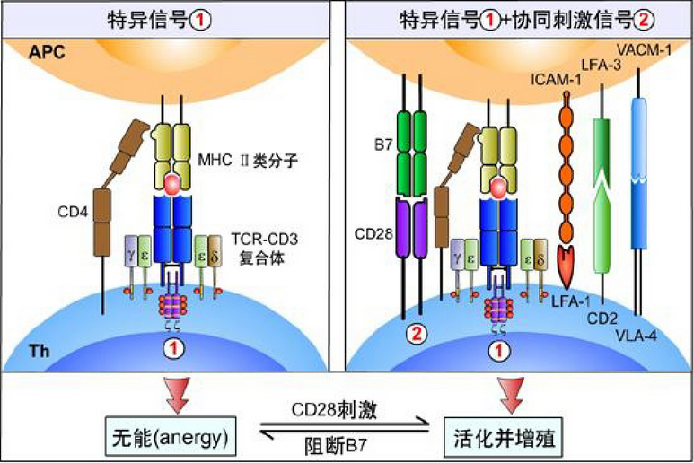
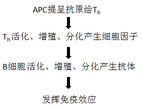

<a name="content">目录</a>

[免疫学相关知识](#title)
- [1. 免疫器官和组织](#immune-organ-and-tissue)
	- [1.1.中枢免疫器官](#central-immune-organ)
	- [1.2. 外周免疫器官和组织](#peripheral-immune-organ)
- [2. 抗原](#antigen)
- [3. 抗体](#antibody)
- [4. 克隆选择学说](#clonal-selection-heory)
- [5. 免疫应答的基本过程](#basic-immu-response-process)
	- [5.1. 抗原呈递](#antigen-present)
	- [5.2. 活化、增殖与分化](#active-reproduce-differetiation)
		- [5.2.1. Th细胞的活化、增殖与分化](#th-active)
		- [5.2.2. B细胞的活化、增殖与分化](#b-active)
	- [5.3. B细胞介导的体液免疫应答](#b-cell-immu-response)
	- [5.4. CD8+ T细胞介导的细胞免疫应答](#t-cell-immu-response)
- [PD-1/PD-L1免疫疗法](#pd-l)

<h1 name="title">免疫学相关知识</h1>

<a name="immune-organ-and-tissue"><h2>1. 免疫器官和组织 [目录](#content)</h2></a>

免疫系统包括免疫器官、组织、免疫细胞和免疫分子

免疫器官包括：骨髓、胸腺、脾脏和淋巴结

免疫器官按照其功能的不同，又可以分为**中枢免疫器官**和**外周免疫器官**

<a name="central-immune-organ"><h3>1.1.中枢免疫器官 [目录](#content)</h3></a>

人或其他哺乳动物的中枢免疫器官包括**骨髓**和**胸腺**

- **（1） 骨髓**

	骨髓是各类血细胞的发源地，由造血干细胞（HSC）定向分化而成

	

	祖B细胞在骨髓中继续分化为成熟B细胞，祖T细胞则经血液循环迁移至胸腺，在胸腺微环境的诱导下进一步分化为成熟T细胞

	成熟的B、T细胞离开骨髓或胸腺，经血液循环迁移并定居在外周免疫器官

	**骨髓除了是各类血细胞发生和成熟的场所之外，还是体液免疫应答发生的场所**：

	> 记忆B细胞在外周免疫器官收抗原再次刺激而被激活，随后经淋巴液和血液迁移至骨髓，在此分化为成熟浆细胞，持久地产生大量抗体并释放到血液循环

- **（2）胸腺**

	

	胸腺是T细胞分化、发育和成熟的场所

	其由胸腺细胞和胸腺基质细胞组成，胸腺细胞是处于不同分化阶段的T细胞

	胸腺的结构：

	> 胸腺从其功能和解剖结构上将其分为两大部分：皮质和髓质
	>
	> - 皮质
	>
	> 	皮质内85%~90%的细胞为胸腺细胞，且主要是未成熟的T细胞）
	>
	> - 髓质
	>
	> 	髓质内含有大量的胸腺髓质上皮细胞、疏散分布的较成熟的T细胞、单核/巨噬细胞和DC细胞

	胸腺微环境：

	> 主要由胸腺基质细胞、细胞外基质和局部活性因子组成
	>
	> 胸腺上皮细胞是胸腺微环境最重要的组分，呈星形，其突起相互连接成网状
	>
	> 胸腺上皮细胞以两种方式影响T细胞的分化和发育：
	>
	> - 分泌细胞因子和胸腺肽类分子
	> - 细胞-细胞间接触

	胸腺的作用：

	> - T细胞分化、成熟的场所
	>
	> 	从骨髓迁入胸腺的T细胞按照被膜下 $\to$ 皮质 $\to$髓质的顺序移行，在胸腺微环境下，经过阳性选择和阴性选择，大约有90%的T细胞会发生凋亡，少部分T细胞会获得自身免疫耐受和MHC限制性抗原识别能力，发育为成熟的T细胞
	>
	> - 自身免疫耐受的建立
	>
	> 	自身反应性T细胞通过其表面表达的TCR与基质细胞表面表达的自身抗原肽发生高亲和力结合，引起阴性选择，启动细胞程序性凋亡，形成对自身抗原的中枢耐受

<a name="peripheral-immune-organ"><h3>1.2. 外周免疫器官和组织 [目录](#content)</h3></a>

- **淋巴结**

	

	淋巴结的实质分为皮质和髓质

	（1）皮质
	
	分为浅皮质区和深皮质区（副皮质区）

	浅皮质区：
	
	> B细胞定居的地方
	>
	> 大量的B细胞聚集成初级淋巴滤泡，受抗原刺激后，内部出现生发中心，称为次级淋巴滤泡

	副皮质区：
	
	> T细胞定居的地方
	>
	> 内行从组织迁移来的DC细胞

	（2）髓质

	内行B细胞和浆细胞，也有部分T细胞和Mφ

	下图描述的是淋巴细胞的归巢和再循环（黑色箭头）以及抗原如何到达淋巴结（红色箭头）

	

	淋巴结的功能：

	> - T、B细胞定居的场所
	>
	> - 免疫应答发生的场所
	>
	> 	$$游离抗原\quad \begin{matrix}输入淋巴管 \\ \to \end{matrix}\quad DC摄取（副皮）\quad \begin{matrix}加工 \\ \to \end{matrix}抗原肽\to T细胞\\ \begin{matrix}增殖、分化 \\ \to \end{matrix}\quad Th细胞\quad \begin{matrix}激活 \\ \to \end{matrix} \quad B细胞 \to 浆细胞$$
	>
	> 	浆细胞：少部分留在髓质，寿命短；大部分通过血液循环回到骨髓，长期、持续产生高亲和力抗体
	>
	> 	效应T细胞：少部分留在髓质，大部分进入血液循环，分布全身
	>
	> - 过滤作用
	>
	> 	淋巴液在淋巴窦中缓慢流动，使得窦内的Mφ，有充足的时间杀伤病原微生物

- **脾**

	

	脾的实质分为白髓和红髓

	T、B细胞在中央末端的边缘窦分别进入动脉周围淋巴鞘（图中蓝色部分）和脾小结（图中黄色部分）

	脾的功能与淋巴结类似，它们的主要区别在于：

	> - 脾：对血源性抗原产生免疫应答的场所；
	> - 淋巴结：对由淋巴液引流来的抗原产生免疫应答；

<a name="antigen"><h2>2. 抗原 [目录](#content)</h2></a>

**免疫原性**（immunogenicty）：抗原被T、B细胞表面特异性抗原受体（TCR和BCR）识别和结合，诱导机体产生适应性免疫应答的能力；

**免疫反应性**：抗原与其诱导的免疫反应应答的物质特异性结合的能力；

免疫原性 + 免疫反应性 = 完全抗原

只有免疫反应性 = 半抗原/不完全抗原

顺序表位和构象表位：

根据T细胞和B细胞识别表位的不同，又可以分为T细胞表位和B细胞表位：

> - T细胞表位：由APC加工后与MHC分子结合并表达于APC表面的**线性表位**；
>
> - B细胞表位：大多为**构象表位**，少数为线性表位；

半抗原为什么在加上载体后会获得免疫原性？

> 半抗原一般只有B细胞表位，而无T细胞表位；
>
> 蛋白质载体含有CD4+T细胞表位，被B细胞或APC提呈并活化CD4+T细胞，分化为Th细胞；

非特异性免疫刺激剂：

> - **超抗原** (Superantigen, SAg)
>
> 	普通蛋白质抗原含有若干个抗原表位，一般能特异性激活机体总T细胞库中万分之一至百万分之一的T细胞克隆
>
> 	而超抗原只需极低的浓度，即可非特异性激活人体总T细胞中2%~20%的T细胞克隆
>
> 	超抗原本质上是多克隆激活剂
>
> 	

>
> 	**超抗原并非针对抗原本身，而是通过非特异性激活免疫细胞，分泌大量炎症因子，导致中毒性休克、多器官衰竭等严重病例过程**
>
> - 佐剂
>
> 	预先或与抗原同时注入机体，可增强机体对抗原的免疫应答
>
> 	分为弗氏完全佐剂和弗氏不完全佐剂

<a name="antibody"><h2>3. 抗体 [目录](#content)</h2></a>

- Ab的结构

	

	高变区中与抗原特异性结合的位置称为互补决定区(complementarity determining region, CDR)，分别用CDR1、CDR2和CDR3来表示，其中CDR3区域变换程度最大

	不同抗体的CH的长度不一致，IgG、IgA、IgD的CH有CH1、CH2和CH3三个结构域。IgM和IgE有CH1、CH2、CH3和**CH4**四个结构域

- Ab的水解片段

	

- Ab的作用

	

<a name="clonal-selection-heory"><h2>4. 克隆选择学说 [目录](#content)</h2></a>

1950年澳大利亚科学家Burnet提出来克隆选择学说 (clonal selection heory)，该理论的提出主要是源于对天然免疫耐受和人工免疫耐受实验结果的思考

天然免疫耐受实验：

> 1945年，Ray Owen 发现，因为牛胎盘独特的结构，异卵双生、胎盘融合的小牛个体内，两种血型的红细胞共存而不发生免疫反应，在体内形成血型嵌合体

人工免疫耐受实验：

> 英国免疫学家 Peter Medawar 等人在1953年应用小鼠皮片移植的实验模型，成功地进行了人工免疫耐受实验，即新生属或胚胎期如接受了另一品系的组织抗原刺激（注射脾细胞），成年后该品系小鼠移植的皮片能长期存活，而对其他无关品系移植的皮肤仍然能发生强烈的排斥反应。
>
> Medawar认为，动物胚胎期或新生期接触抗原，可使其发生免疫耐受，使动物到成年期对该抗原发生特异性的不应答

克隆选择学说：

> 全身的免疫细胞是由众多识别不同抗原的细胞克隆所组成的，同一种克隆细胞表达相同的特异性受体，淋巴细胞识别抗原的多样性是几天接触抗原以前就预先形成的，是生物在长期的进化过程中获得的。
>
> 抗原侵入后，机体只是从免疫细胞库中选择出能识别这些抗原的相应的淋巴细胞克隆，并使其活化、增殖，扩增出许多具有相同特异性的子代细胞，产生大量特异性抗体，清除入侵的抗原
>
> 机体自身的组织抗原成分在胚胎期就被相应的细胞克隆所识别，这些细胞克隆产生的特异性免疫耐受，赋予机体免疫系统区别“自己”与“非己”的能力。

实际上，在胚胎期任何进入机体的抗原都将被视为自身成分而产生免疫耐受

淋巴细胞的克隆选择大致包括四个阶段：

> 

>
> - 淋巴干细胞分化为多种多样的淋巴细胞克隆；
> - 未成熟淋巴细胞结合自身抗原后被克隆清除，诱导自身免疫耐受；
> - 成熟淋巴细胞识别外来抗原发生活化和增殖；
> - 受抗原刺激的淋巴细胞分化为效应细胞并清除抗原；

<a name="basic-immu-response-process"><h2>5. 免疫应答的基本过程 [目录](#content)</h2></a>

免疫应答的三个过程：
> - 第一阶段：抗原呈递与识别
> - 第二阶段：活化、增值与分化
> - 第三阶段：效应阶段

<a name="antigen-present"><h3>5.1. 抗原呈递 [目录](#content)</h3></a>

抗原根据来源可以分为两种：
> - 内源性抗原 (endogenpus antigens)：位于细胞内的蛋白质抗原，如：病毒蛋白、肿瘤抗原
> - 外源性抗原 (exogenous antigens)：位于细胞外的蛋白质抗原，如：细胞外感染的微生物及其产物

<table>
<tr>
	<td></td>
	<td></td>
</tr>
<tr>
	<td>
内源性抗原呈递
</td>
	<td>
外源性抗原呈递
</td>
</tr>
</table>

<a name="active-reproduce-differetiation"><h3>5.2. 活化、增殖与分化 [目录](#content)</h3></a>

Th细胞和B细胞识别抗原后，自身活化、增殖、分化为效应细胞。Th细胞必须激活才具有辅助B细胞产生抗体的能力。

<a name="th-active"><h4>5.2.1. Th细胞活化、增殖与分化  [目录](#content)</h4></a>

T细胞的活化需要双信号的参与，这种活化是免疫效应机制发生的基础
> - **第一信号**：Th 细胞表面的TCR识别抗原呈递细胞表面表达的抗原肽-MHC-I/II类分子复合物后，在CD8/CD4分子同时识别MHC-I/II类分子的辅助下，通过CD3分子将这种识别信号传递回细胞内。

> - **第二信号**：抗原呈递细胞表面的共刺激分子与T细胞表面表达的相应共刺激分子受体相互作用，可以产生T细胞活化的辅助信号。

|信号|T细胞|APC|
|:-----:|:-----:|:-----:|
|第一信号|TCR|MHC-抗原复合物|
|` `|CD4|MHC-II类分子|
|第二信号|CD28|B7|

Th 细胞活化后，开始增殖、分化并在其细胞表面表达IL-2、4、12等受体，同时分泌产生IL-2、4、12等并与之结合，导致 Th 细胞的增殖

- 在 IL-4为主的细胞因子的作用下分化为Th2， Th2 细胞通过分泌IL-4、5、6、10、13促进的B细胞的增殖分化；
- 在 IL-12为主的细胞因子的作用下分化为Th1，参与细胞免疫；

<a name="b-active"><h4>5.2.2. B 细胞活化、增殖与分化  [目录](#content)</h4></a>

B细胞的活化也需要两个信号
> - 第一活化信号： BCR与抗原结合 第一活化信号由CD79传导入胞内
> - 第二活化信号：协同刺激信号（由活化的Th细胞提供）

<a name="b-cell-immu-response"><h3>5.3. B细胞介导的体液免疫应答  [目录](#content)</h3></a>

抗原诱导B细胞产生抗体需要辅助性T细胞 (CD4+ T cell 或 Helper T cell,Th)

<a name="t-cell-immu-response"><h3>5.4. CD8+ T细胞介导的细胞免疫应答 [目录](#content)</h3></a>

<a name="pd-l"><h3>PD-1/PD-L1免疫疗法 [目录](#content)</h3></a>

什么是PD-1/PD-L1免疫疗法？

简单来讲，PD-1/PD-L1免疫疗法就是通过药物阻断PD-1/PD-L1通路，激活人体自身的免疫系统攻击肿瘤细胞。

其实，不妨将这里的PD-1/PD-L1通路理解成一对“接头暗语”，PD-1受体是活化T细胞的“天王盖地虎”，PD-L1受体是抗原呈递细胞的“宝塔镇河妖”，暗语一旦对接成功，免疫细胞就认为“没有异常”，于是便不会发动攻击。这本来是进化给人的一份神奇馈赠，但不知怎么的，癌细胞这家伙也偷学会了暗语，它在遇见T细胞时也能对出“宝塔镇河妖”，成功“粉饰太平”蒙蔽了T细胞，最后避免了被免疫细胞攻击的命运。

在这种情况下，免疫疗法就出来帮忙了，它使用药物封住通路，如此一来，即使肿瘤细胞知道暗语也无计可施，只能被当成“异己分子”接受免疫细胞的攻击了。

参考资料：

(1) 人民卫生出版社《医学免疫学（第6版）》，曹雪涛主编

(2) [PD-1药物到底是个什么东西?](http://ioc.waikong.hk/xinwenzixun/1553.html)

